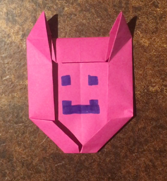

# The Jungendhackt Origami Alpaca - Tutorial

This project was created during the jungedhackt event in Frankfurt during 30.06.2017 - 02.07.2017. The intension was to create an origami version of the alpaca logo of Jungendhackt. 

This is the first version. You are invited to improve this origami version. 

Best regards -- jerik 
